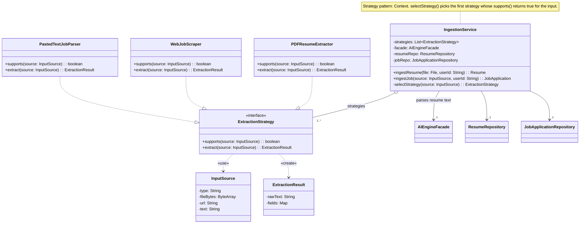

# 2.1 Class Diagram

The class diagram is split into four views so every class, attribute and method stays readable. Views are connected by shared class names: a class shown as an empty box in one view is fully defined in another.

| View | Contents |
|---|---|
| A | Presentation (GUI, CLI), controllers, services, export, analytics |
| B | Agent layer and AI subsystem (Planner, Tools, Memory, Facade, Prompt Factory, LLM Adapter) |
| C | Domain model, State pattern, Observer pattern, repositories |
| D | Ingestion (Strategy pattern) |

Persistence note: every `*Repository` interface has a PostgreSQL implementation (for example `PostgresJobApplicationRepository`), omitted for readability.

---

## View A: Presentation, Controllers and Services

```mermaid
classDiagram
    direction TB

    class KanbanDashboardUI {
        <<frontend>>
        +uploadResume(file: File)
        +importJob(source: String)
        +requestFeature(applicationId: String, featureType: String)
        +moveCard(applicationId: String, newStage: String)
        +setDeadline(applicationId: String, dueAt: DateTime)
        +sendAgentRequest(message: String)
        +updateDashboard(alertMessage: String)
    }

    class CLIApp {
        +main(args: List~String~)
        -parse(args: List~String~): Command
    }
    class CommandInvoker {
        -history: List~Command~
        +execute(command: Command): CommandResult
    }
    class Command {
        <<interface>>
        +execute(): CommandResult
    }
    class ImportResumeCommand {
        -filePath: String
        +execute(): CommandResult
    }
    class ImportJobCommand {
        -urlOrText: String
        +execute(): CommandResult
    }
    class AnalyzeMatchCommand {
        -applicationId: String
        +execute(): CommandResult
    }
    class GenerateCoverLetterCommand {
        -applicationId: String
        -tone: String
        +execute(): CommandResult
    }
    class RunAgentCommand {
        -message: String
        +execute(): CommandResult
    }
    class CommandResult {
        -success: boolean
        -output: String
    }

    class ResumeController {
        +uploadResume(file: File, userId: String): Resume
        +getResume(userId: String): Resume
    }
    class JobController {
        +importJob(source: InputSource, userId: String): JobApplication
        +listBoard(userId: String): List~JobApplication~
    }
    class ApplicationController {
        +changeStage(applicationId: String, newStage: String): JobApplication
        +setDeadline(applicationId: String, dueAt: DateTime): JobApplication
    }
    class AIFeatureController {
        +analyzeMatch(applicationId: String): MatchResult
        +generateCoverLetter(applicationId: String, tone: String): CoverLetter
        +generatePrepSheet(applicationId: String): PrepSheet
        +optimizeBullet(bulletId: String, applicationId: String): List~BulletSuggestion~
        +startMockInterview(applicationId: String): MockInterviewSession
        +submitAnswer(sessionId: String, answer: String): AnswerFeedback
    }
    class AnalyticsController {
        +getDashboardMetrics(userId: String): DashboardMetrics
    }
    class ExportController {
        +exportPackage(applicationId: String, format: String): ExportFile
    }

    class ApplicationService {
        +changeStage(applicationId: String, newStage: String): JobApplication
        +setDeadline(applicationId: String, dueAt: DateTime): JobApplication
    }
    class MetricsService {
        +countByStage(userId: String): Map
        +calculateConversionRate(userId: String): double
        +volumeOverTime(userId: String): List~DataPoint~
    }
    class DocumentGenerator {
        +generatePDF(resume: Resume, letter: CoverLetter): ExportFile
        +generatePlainText(resume: Resume, letter: CoverLetter): ExportFile
    }
    class DashboardMetrics {
        -totalApplications: int
        -countByStage: Map
        -conversionRates: Map
        -volume: List~DataPoint~
    }
    class DataPoint {
        -label: String
        -value: int
    }
    class ExportFile {
        -fileName: String
        -mimeType: String
        -content: ByteArray
    }

    KanbanDashboardUI ..> ResumeController : «use» REST
    KanbanDashboardUI ..> JobController : «use» REST
    KanbanDashboardUI ..> ApplicationController : «use» REST
    KanbanDashboardUI ..> AIFeatureController : «use» REST
    KanbanDashboardUI ..> AnalyticsController : «use» REST
    KanbanDashboardUI ..> ExportController : «use» REST
    KanbanDashboardUI ..> AgentController : «use» REST

    CLIApp --> "1" CommandInvoker
    CommandInvoker o-- "0..*" Command : history
    ImportResumeCommand ..|> Command
    ImportJobCommand ..|> Command
    AnalyzeMatchCommand ..|> Command
    GenerateCoverLetterCommand ..|> Command
    RunAgentCommand ..|> Command
    Command ..> CommandResult : «use»
    ImportResumeCommand --> "1" ResumeController : receiver
    ImportJobCommand --> "1" JobController : receiver
    AnalyzeMatchCommand --> "1" AIFeatureController : receiver
    GenerateCoverLetterCommand --> "1" AIFeatureController : receiver
    RunAgentCommand --> "1" AgentController : receiver

    ResumeController --> "1" IngestionService
    JobController --> "1" IngestionService
    ApplicationController --> "1" ApplicationService
    ApplicationService --> "1" JobApplicationRepository
    ApplicationService ..> JobApplication : «use»
    AIFeatureController --> "1" AIEngineFacade
    AIFeatureController --> "1" JobApplicationRepository
    AIFeatureController --> "1" ResumeRepository
    AnalyticsController --> "1" MetricsService
    MetricsService --> "1" JobApplicationRepository
    MetricsService ..> DashboardMetrics : «create»
    DashboardMetrics *-- "0..*" DataPoint
    ExportController --> "1" DocumentGenerator
    ExportController --> "1" JobApplicationRepository
    DocumentGenerator ..> ExportFile : «create»

    note for CommandInvoker "Command pattern: Invoker. Each concrete command wraps one CLI request; the controllers are the receivers."
    note for KanbanDashboardUI "Next.js/React boundary class. It talks to the Java backend only through REST calls."
```

---

## View B: Agent Layer and AI Subsystem

```mermaid
classDiagram
    direction TB

    class AgentController {
        -planner: Planner
        -toolManager: ToolManager
        -memory: MemoryManager
        -validator: ResponseValidator
        +handleRequest(userId: String, message: String): AgentResponse
        -executePlan(plan: Plan): List~ToolResult~
    }
    class AgentResponse {
        -message: String
        -executedSteps: List~PlanStep~
        -success: boolean
    }
    class Planner {
        -facade: AIEngineFacade
        +createPlan(request: String, context: List~MemoryEntry~): Plan
        +replan(plan: Plan, failedStep: PlanStep): Plan
    }
    class Plan {
        -goal: String
        -steps: List~PlanStep~
        +nextStep(): PlanStep
        +isComplete(): boolean
    }
    class PlanStep {
        -toolName: String
        -arguments: Map
        -status: String
        -result: ToolResult
    }
    class ToolManager {
        -registry: Map
        +register(tool: Tool)
        +getAvailableTools(): List~ToolInfo~
        +executeTool(name: String, args: Map): ToolResult
    }
    class ToolInfo {
        -name: String
        -description: String
    }
    class Tool {
        <<interface>>
        +getName(): String
        +getDescription(): String
        +validateArgs(args: Map): boolean
        +execute(args: Map): ToolResult
    }
    class ToolResult {
        -success: boolean
        -data: Object
        -errorMessage: String
    }
    class ResumeParserTool {
        +execute(args: Map): ToolResult
    }
    class JobImportTool {
        +execute(args: Map): ToolResult
    }
    class MatchAnalysisTool {
        +execute(args: Map): ToolResult
    }
    class CoverLetterTool {
        +execute(args: Map): ToolResult
    }
    class PrepSheetTool {
        +execute(args: Map): ToolResult
    }
    class BulletOptimizerTool {
        +execute(args: Map): ToolResult
    }
    class MemoryManager {
        -repository: MemoryRepository
        +saveInteraction(userId: String, entry: MemoryEntry)
        +recall(userId: String, query: String): List~MemoryEntry~
        +getHistory(userId: String): List~MemoryEntry~
    }
    class MemoryEntry {
        -role: String
        -content: String
        -createdAt: DateTime
    }
    class MemoryRepository {
        <<interface>>
        +save(userId: String, entry: MemoryEntry)
        +findByUser(userId: String): List~MemoryEntry~
    }
    class ResponseValidator {
        +validateToolArgs(tool: Tool, args: Map): ValidationResult
        +validateLLMOutput(rawJson: String, schema: String): ValidationResult
    }
    class ValidationResult {
        -valid: boolean
        -errors: List~String~
    }

    class AIEngineFacade {
        -llmClient: LLMClient
        -parser: JSONResponseParser
        -validator: ResponseValidator
        +parseResume(rawText: String): Resume
        +analyzeSkillGap(resume: Resume, job: JobPosting): MatchResult
        +generateCoverLetter(resume: Resume, job: JobPosting, tone: String): CoverLetter
        +generatePrepSheet(job: JobPosting): PrepSheet
        +optimizeBullet(bullet: BulletPoint, job: JobPosting): List~BulletSuggestion~
        +evaluateAnswer(question: InterviewQuestion, answer: String): AnswerFeedback
        +planSteps(request: String, tools: List~ToolInfo~): Plan
    }
    class JSONResponseParser {
        +parseResume(json: String): Resume
        +parseMatchResult(json: String): MatchResult
        +parseCoverLetter(json: String): CoverLetter
        +parsePrepSheet(json: String): PrepSheet
        +parseBullets(json: String): List~BulletSuggestion~
        +parseFeedback(json: String): AnswerFeedback
        +parsePlan(json: String): Plan
    }

    class PromptContext {
        -resume: Resume
        -job: JobPosting
        -tone: String
        -bulletText: String
        -userRequest: String
        -tools: List~ToolInfo~
        -questionText: String
        -answerText: String
    }
    class PromptFactory {
        <<abstract>>
        +createPrompt(context: PromptContext): LLMPrompt*
    }
    class MatchPromptFactory {
        +createPrompt(context: PromptContext): LLMPrompt
    }
    class CoverLetterPromptFactory {
        +createPrompt(context: PromptContext): LLMPrompt
    }
    class PrepSheetPromptFactory {
        +createPrompt(context: PromptContext): LLMPrompt
    }
    class BulletPromptFactory {
        +createPrompt(context: PromptContext): LLMPrompt
    }
    class ResumeParsePromptFactory {
        +createPrompt(context: PromptContext): LLMPrompt
    }
    class PlanningPromptFactory {
        +createPrompt(context: PromptContext): LLMPrompt
    }
    class MockInterviewPromptFactory {
        +createPrompt(context: PromptContext): LLMPrompt
    }

    class LLMPrompt {
        <<interface>>
        +buildPromptString(): String
        +getExpectedSchema(): String
    }
    class MatchAnalysisPrompt {
        +buildPromptString(): String
    }
    class CoverLetterPrompt {
        +buildPromptString(): String
    }
    class InterviewPrompt {
        +buildPromptString(): String
    }
    class BulletOptimizerPrompt {
        +buildPromptString(): String
    }
    class ResumeParsePrompt {
        +buildPromptString(): String
    }
    class PlanningPrompt {
        +buildPromptString(): String
    }
    class MockInterviewPrompt {
        +buildPromptString(): String
    }

    class LLMClient {
        <<interface>>
        +generate(prompt: LLMPrompt): LLMResponse
    }
    class LLMResponse {
        -rawText: String
        -statusCode: int
    }
    class GeminiClient {
        -adaptee: GeminiRestAPI
        -http: HTTPClientManager
        -auth: TokenAuthenticator
        -timeoutMs: int
        +generate(prompt: LLMPrompt): LLMResponse
    }
    class HTTPClientManager {
        +post(url: String, headers: Map, body: String): String
    }
    class TokenAuthenticator {
        +getAuthHeaders(): Map
    }
    class GeminiRestAPI {
        <<external>>
        +generateContent(jsonBody: String): String
    }

    AgentController --> "1" Planner
    AgentController --> "1" ToolManager
    AgentController --> "1" MemoryManager
    AgentController --> "1" ResponseValidator
    AgentController ..> AgentResponse : «create»
    Planner --> "1" AIEngineFacade
    Planner ..> ToolManager : «use» tool descriptions
    Planner ..> Plan : «create»
    Plan *-- "1..*" PlanStep
    PlanStep --> "0..1" ToolResult
    ToolManager o-- "0..*" Tool : registry
    ToolManager ..> ToolInfo : «create»
    ResumeParserTool ..|> Tool
    JobImportTool ..|> Tool
    MatchAnalysisTool ..|> Tool
    CoverLetterTool ..|> Tool
    PrepSheetTool ..|> Tool
    BulletOptimizerTool ..|> Tool
    Tool ..> ToolResult : «create»
    MatchAnalysisTool --> "1" AIEngineFacade
    CoverLetterTool --> "1" AIEngineFacade
    PrepSheetTool --> "1" AIEngineFacade
    BulletOptimizerTool --> "1" AIEngineFacade
    ResumeParserTool --> "1" IngestionService
    JobImportTool --> "1" IngestionService
    MemoryManager --> "1" MemoryRepository
    MemoryManager o-- "0..*" MemoryEntry
    ResponseValidator ..> ValidationResult : «create»

    AIEngineFacade --> "1" LLMClient
    AIEngineFacade --> "1" JSONResponseParser
    AIEngineFacade --> "1" ResponseValidator
    AIEngineFacade ..> PromptFactory : «use»
    AIEngineFacade ..> PromptContext : «create»
    PromptFactory ..> PromptContext : «use»

    PromptFactory <|-- MatchPromptFactory
    PromptFactory <|-- CoverLetterPromptFactory
    PromptFactory <|-- PrepSheetPromptFactory
    PromptFactory <|-- BulletPromptFactory
    PromptFactory <|-- ResumeParsePromptFactory
    PromptFactory <|-- PlanningPromptFactory
    PromptFactory <|-- MockInterviewPromptFactory
    MatchPromptFactory ..> MatchAnalysisPrompt : «create»
    CoverLetterPromptFactory ..> CoverLetterPrompt : «create»
    PrepSheetPromptFactory ..> InterviewPrompt : «create»
    BulletPromptFactory ..> BulletOptimizerPrompt : «create»
    ResumeParsePromptFactory ..> ResumeParsePrompt : «create»
    PlanningPromptFactory ..> PlanningPrompt : «create»
    MockInterviewPromptFactory ..> MockInterviewPrompt : «create»
    MatchAnalysisPrompt ..|> LLMPrompt
    CoverLetterPrompt ..|> LLMPrompt
    InterviewPrompt ..|> LLMPrompt
    BulletOptimizerPrompt ..|> LLMPrompt
    ResumeParsePrompt ..|> LLMPrompt
    PlanningPrompt ..|> LLMPrompt
    MockInterviewPrompt ..|> LLMPrompt

    GeminiClient ..|> LLMClient
    GeminiClient --> "1" GeminiRestAPI : adaptee
    GeminiClient --> "1" HTTPClientManager
    GeminiClient --> "1" TokenAuthenticator
    LLMClient ..> LLMResponse : «create»

    note for AIEngineFacade "Facade pattern: single entry point that hides prompt creation, the LLM client, response parsing and validation."
    note for PromptFactory "Factory Method pattern: Creator. Each subclass decides which LLMPrompt (Product) to create."
    note for GeminiClient "Adapter pattern (object adapter): implements the LLMClient target and holds the GeminiRestAPI adaptee. generate() translates a prompt into generateContent(jsonBody)."
    note for Tool "Each concrete tool implements all four Tool methods; only execute() is shown. Tools wrap services and the facade so the Planner can invoke them by name."
```

---

## View C: Domain Model, State Pattern, Observer Pattern, Repositories

```mermaid
classDiagram
    direction TB

    class User {
        -userId: String
        -email: String
        -displayName: String
    }
    class Resume {
        -resumeId: String
        -rawText: String
        -uploadedAt: DateTime
        +getSkills(): List~Skill~
        +getBullets(): List~BulletPoint~
    }
    class Skill {
        -name: String
        -category: String
    }
    class Experience {
        -company: String
        -title: String
        -startDate: Date
        -endDate: Date
    }
    class BulletPoint {
        -bulletId: String
        -text: String
    }
    class Education {
        -institution: String
        -degree: String
        -graduationDate: Date
    }
    class JobPosting {
        -jobId: String
        -title: String
        -company: String
        -description: String
        -sourceUrl: String
        +getDetails(): String
    }
    class JobApplication {
        -applicationId: String
        -deadline: DateTime
        -currentState: ApplicationState
        +changeState(target: String)
        +setDeadline(dueAt: DateTime)
        +getStageName(): String
    }

    class ApplicationState {
        <<interface>>
        +handleTransition(app: JobApplication, target: String)
        +getStageName(): String
        +allowedTransitions(): List~String~
        +canScheduleInterview(): boolean
    }
    class WishlistState {
        +handleTransition(app: JobApplication, target: String)
    }
    class AppliedState {
        +handleTransition(app: JobApplication, target: String)
    }
    class InterviewingState {
        +handleTransition(app: JobApplication, target: String)
    }
    class OfferState {
        +handleTransition(app: JobApplication, target: String)
    }
    class RejectedState {
        +handleTransition(app: JobApplication, target: String)
    }

    class MatchResult {
        -score: int
        -matchedSkills: List~String~
        -missingSkills: List~String~
        -summary: String
    }
    class CoverLetter {
        -letterId: String
        -text: String
        -tone: String
        -createdAt: DateTime
    }
    class PrepSheet {
        -usedFallback: boolean
        -createdAt: DateTime
    }
    class InterviewQuestion {
        -text: String
        -category: String
    }
    class BulletSuggestion {
        -originalText: String
        -suggestedText: String
        -rationale: String
    }
    class MockInterviewSession {
        -sessionId: String
        -status: String
        +nextQuestion(): InterviewQuestion
        +recordAnswer(answer: String, feedback: AnswerFeedback)
    }
    class AnswerFeedback {
        -questionText: String
        -userAnswer: String
        -feedbackText: String
        -score: int
    }
    class Notification {
        -notificationId: String
        -message: String
        -isRead: boolean
        -createdAt: DateTime
    }

    class DeadlineScheduler {
        -intervalMinutes: int
        +start()
        +runCheck()
    }
    class DeadlineSubject {
        -observers: List~DeadlineObserver~
        -thresholdHours: int
        +registerObserver(observer: DeadlineObserver)
        +removeObserver(observer: DeadlineObserver)
        +notifyObservers(event: DeadlineEvent)
        +checkDeadlines()
    }
    class DeadlineObserver {
        <<interface>>
        +onDeadlineEvent(event: DeadlineEvent)
    }
    class DashboardObserver {
        +onDeadlineEvent(event: DeadlineEvent)
    }
    class NotificationAlertObserver {
        +onDeadlineEvent(event: DeadlineEvent)
    }
    class DeadlineEvent {
        -applicationId: String
        -dueAt: DateTime
        -hoursRemaining: int
        -overdue: boolean
    }

    class ResumeRepository {
        <<interface>>
        +save(resume: Resume)
        +findByUser(userId: String): Resume
    }
    class JobApplicationRepository {
        <<interface>>
        +save(application: JobApplication)
        +findById(applicationId: String): JobApplication
        +findByUser(userId: String): List~JobApplication~
        +findDueBefore(time: DateTime): List~JobApplication~
    }
    class NotificationRepository {
        <<interface>>
        +save(notification: Notification)
        +findUnread(userId: String): List~Notification~
    }

    User "1" --> "0..1" Resume
    User "1" --> "0..*" JobApplication
    Resume *-- "0..*" Skill
    Resume *-- "0..*" Experience
    Resume *-- "0..*" Education
    Experience *-- "0..*" BulletPoint
    JobApplication "0..*" --> "1" JobPosting
    JobApplication *-- "0..1" MatchResult
    JobApplication *-- "0..*" CoverLetter
    JobApplication *-- "0..1" PrepSheet
    JobApplication *-- "0..*" MockInterviewSession
    PrepSheet *-- "0..*" InterviewQuestion
    MockInterviewSession *-- "0..*" AnswerFeedback

    JobApplication --> "1" ApplicationState : currentState
    WishlistState ..|> ApplicationState
    AppliedState ..|> ApplicationState
    InterviewingState ..|> ApplicationState
    OfferState ..|> ApplicationState
    RejectedState ..|> ApplicationState

    DeadlineScheduler --> "1" DeadlineSubject : triggers
    DeadlineSubject o-- "0..*" DeadlineObserver
    DeadlineSubject --> "1" JobApplicationRepository
    DeadlineSubject ..> DeadlineEvent : «create»
    DashboardObserver ..|> DeadlineObserver
    NotificationAlertObserver ..|> DeadlineObserver
    NotificationAlertObserver --> "1" NotificationRepository
    NotificationAlertObserver ..> Notification : «create»
    DashboardObserver ..> KanbanDashboardUI : «use» push alert via SSE

    note for JobApplication "State pattern: Context. It delegates every stage change to currentState. States only validate; ApplicationService persists."
    note for DeadlineSubject "Observer pattern: Subject (Publisher). DeadlineScheduler triggers checkDeadlines() on a timer; observers react to events."
```

---

## View D: Ingestion (Strategy Pattern)

---

## 2.1.1 Design Patterns: Participant Map

| # | Pattern | Context / Creator / Subject | Abstraction | Concrete classes |
|---|---|---|---|---|
| 1 | Strategy | `IngestionService` | `ExtractionStrategy` | `PDFResumeExtractor`, `WebJobScraper`, `PastedTextJobParser` |
| 2 | Factory Method | `PromptFactory` (creator) | `LLMPrompt` (product) | 7 concrete factories; `MatchAnalysisPrompt`, `CoverLetterPrompt`, `InterviewPrompt`, `BulletOptimizerPrompt`, `ResumeParsePrompt`, `PlanningPrompt`, `MockInterviewPrompt` |
| 3 | State | `JobApplication` | `ApplicationState` | `WishlistState`, `AppliedState`, `InterviewingState`, `OfferState`, `RejectedState` |
| 4 | Facade | `AIEngineFacade` | (single entry point) | Hides the `PromptFactory` hierarchy, `LLMClient`, `JSONResponseParser`, `ResponseValidator` |
| 5 | Observer | `DeadlineSubject` | `DeadlineObserver` | `DashboardObserver`, `NotificationAlertObserver` (triggered by `DeadlineScheduler`) |
| 6 | Command | `CommandInvoker` | `Command` | `ImportResumeCommand`, `ImportJobCommand`, `AnalyzeMatchCommand`, `GenerateCoverLetterCommand`, `RunAgentCommand` (receivers are the controllers) |
| 7 | Adapter | `GeminiClient` (object adapter) | `LLMClient` (target) | Holds the external `GeminiRestAPI` (adaptee) |

## 2.1.2 Design Principles Demonstrated

- **Dependency inversion:** `AIEngineFacade` depends on the `LLMClient` interface, not on Gemini. Services depend on `*Repository` interfaces, not on PostgreSQL.
- **Separation of concerns:** controllers handle requests, services hold use-case logic, states only validate transitions, repositories only persist, the facade only talks to the AI subsystem.
- **Open/Closed:** a new input type means a new `ExtractionStrategy`, a new AI feature means a new `PromptFactory` plus `LLMPrompt` pair, a new pipeline stage means a new `ApplicationState`, and a new agent capability means a new `Tool`. None of these changes existing classes.
- **Testability:** `LLMClient` can be mocked, so deterministic components can be unit tested without calling Gemini. `ResponseValidator` and `ToolManager` give the agent explicit points where behavior can be checked.
