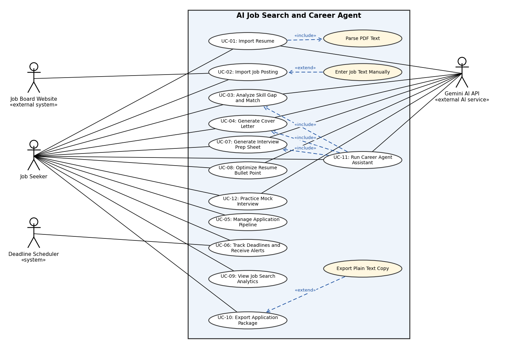

# 2.2 Use-Case Diagram and Use-Case Descriptions

## 2.2.1 Use-Case Diagram

The diagram source is `use_case_diagram.drawio` (open it in draw.io to edit).

### Actors

| Actor | Type | Role |
|---|---|---|
| Job Seeker | Primary | The student or early-career developer who uses the system through the GUI or the CLI |
| Gemini AI API | Secondary, external AI service | Parses resumes, analyzes matches, writes text, plans agent steps and evaluates interview answers |
| Job Board Website | Secondary, external system | Source of job posting pages that are scraped when the user imports a URL |
| Deadline Scheduler | Secondary, system actor | Timer that periodically triggers the deadline check |

### Relationships

| Relationship | Use cases | Meaning |
|---|---|---|
| `«include»` | UC-01 → Parse PDF Text | Resume import always runs PDF text extraction first |
| `«include»` | UC-11 → UC-03, UC-04, UC-07 | The agent's standard preparation plan runs match analysis, cover letter generation and prep sheet generation; the Planner may add other steps such as UC-02 |
| `«extend»` | Enter Job Text Manually → UC-02 | Optional behavior when a job URL cannot be scraped |
| `«extend»` | Export Plain Text Copy → UC-10 | Optional behavior when PDF generation fails |

## 2.2.2 Feature Coverage

| Use Case | Name | Feature |
|---|---|---|
| UC-01 | Import Resume | F01 Resume Import & Parsing |
| UC-02 | Import Job Posting | F02 Job Posting Ingestion |
| UC-03 | Analyze Skill Gap and Match | F03 Skill Gap & Match Analysis |
| UC-04 | Generate Cover Letter | F04 Tailored Cover Letter Generator |
| UC-05 | Manage Application Pipeline | F05 Application Pipeline State Management |
| UC-06 | Track Deadlines and Receive Alerts | F06 Deadline Tracking & Notification Alerts |
| UC-07 | Generate Interview Prep Sheet | F07 Interview Prep Sheet Generator |
| UC-08 | Optimize Resume Bullet Point | F08 Resume Bullet Point Optimizer |
| UC-09 | View Job Search Analytics | F09 Job Search Analytics Dashboard |
| UC-10 | Export Application Package | F10 Application Package Exporter |
| UC-11 | Run Career Agent Assistant | F11 Career Agent Assistant |
| UC-12 | Practice Mock Interview | F12 Mock Interview |

## 2.2.3 Use-Case Descriptions

### UC-01: Import Resume

| Field | Description |
|---|---|
| Use Case ID | UC-01 |
| Name | Import Resume |
| Actor(s) | Job Seeker (primary); Gemini AI API (secondary) |
| Goal | Turn an uploaded PDF resume into a structured profile that the AI features can use |
| Preconditions | The Job Seeker has a user profile and a PDF resume file |
| Trigger | The Job Seeker clicks "Upload Resume" in the GUI, or runs the import-resume command in the CLI |
| Postconditions | A structured `Resume` (skills, experience, bullet points, education) is saved and linked to the user, and is displayed for review |
| Related Feature(s) | F01 |

**Main Success Scenario**
1. The Job Seeker selects a PDF file.
2. The GUI (or CLI command) sends the file to `ResumeController.uploadResume()`.
3. The controller passes it to `IngestionService.ingestResume()`.
4. The service selects `PDFResumeExtractor` and runs the included use case Parse PDF Text to obtain the raw text.
5. The service calls `AIEngineFacade.parseResume(rawText)`. The facade builds a `ResumeParsePrompt` through `ResumeParsePromptFactory` and sends it through `GeminiClient`.
6. Gemini returns structured JSON; `JSONResponseParser` converts it into a `Resume` object.
7. The service saves the resume through `ResumeRepository`.
8. The GUI displays the parsed profile for the Job Seeker to review.

**Alternative / Exception Flows**
- 3a. Unsupported file type: the system rejects the file with "Invalid File Type - Please upload a PDF". Nothing is saved.
- 4a. Text extraction fails or the PDF is unreadable: the system shows an error asking the Job Seeker to try another file or enter the information manually. Nothing is saved.
- 5a. Gemini times out, fails, or returns malformed data: the error is logged and the Job Seeker is told structured parsing failed. The extracted raw text is kept so parsing can be retried.

### UC-02: Import Job Posting

| Field | Description |
|---|---|
| Use Case ID | UC-02 |
| Name | Import Job Posting |
| Actor(s) | Job Seeker (primary); Job Board Website (secondary, for URL imports) |
| Goal | Save a job posting as a new card on the Kanban board |
| Preconditions | The Job Seeker has a user profile and a job URL or pasted job text |
| Trigger | The Job Seeker pastes a URL or text and clicks "Import Job" (GUI), or runs the import-job command (CLI) |
| Postconditions | A `JobPosting` and a `JobApplication` in the Wishlist state are saved, and the card appears on the board |
| Related Feature(s) | F02 |

**Main Success Scenario**
1. The Job Seeker submits a URL or raw job text.
2. The GUI (or CLI command) sends it to `JobController.importJob()`.
3. The controller calls `IngestionService.ingestJob()`, which selects `WebJobScraper` for a URL or `PastedTextJobParser` for text.
4. For a URL, `WebJobScraper` requests the page from the Job Board Website and extracts the title, company and description.
5. The strategy returns an `ExtractionResult`; the service builds a `JobPosting` and a `JobApplication` in the Wishlist state.
6. The service saves them through `JobApplicationRepository`.
7. The GUI adds a new card to the Wishlist column.

**Alternative / Exception Flows**
- 2a. Empty input: the system asks the Job Seeker to enter a URL or text.
- 4a. The page is blocked by bot protection, unreachable, or not found: the system alerts the Job Seeker and offers the extending use case Enter Job Text Manually, where the Job Seeker pastes the description and the flow continues at step 3 with `PastedTextJobParser`.
- 5a. Title or description cannot be extracted: the system rejects the import and asks the Job Seeker to paste the complete job description.

### UC-03: Analyze Skill Gap and Match

| Field | Description |
|---|---|
| Use Case ID | UC-03 |
| Name | Analyze Skill Gap and Match |
| Actor(s) | Job Seeker (primary); Gemini AI API (secondary) |
| Goal | Get a match score and the list of key skills missing from the resume for a specific job |
| Preconditions | A resume has been imported (UC-01) and the job posting is saved (UC-02) |
| Trigger | The Job Seeker clicks "Run Match Analysis" on a job card |
| Postconditions | A `MatchResult` is saved on the application and displayed on the job card |
| Related Feature(s) | F03 |

**Main Success Scenario**
1. The Job Seeker clicks "Run Match Analysis" on a job card.
2. The GUI sends the application ID to `AIFeatureController.analyzeMatch()`.
3. The controller loads the resume through `ResumeRepository` and the application through `JobApplicationRepository`.
4. The controller calls `AIEngineFacade.analyzeSkillGap(resume, job)`. `MatchPromptFactory` creates a `MatchAnalysisPrompt`.
5. `GeminiClient` sends the prompt to Gemini and returns the response.
6. `ResponseValidator` checks the JSON and `JSONResponseParser` builds a `MatchResult` (score, matched skills, missing skills, summary).
7. The `MatchResult` is saved on the application.
8. The GUI shows the score and missing skills on the job card.

**Alternative / Exception Flows**
- 3a. No resume or no job posting exists: the system blocks the request and asks the Job Seeker to complete the missing step.
- 5a. Gemini times out or fails: the error is logged and the GUI asks the Job Seeker to retry later. No result is saved.
- 6a. The response is malformed: the facade retries once; if it is still invalid, the flow continues as in 5a.

### UC-04: Generate Cover Letter

| Field | Description |
|---|---|
| Use Case ID | UC-04 |
| Name | Generate Cover Letter |
| Actor(s) | Job Seeker (primary); Gemini AI API (secondary) |
| Goal | Get a cover letter draft tailored to a specific job |
| Preconditions | A resume has been imported (UC-01) and the job posting is saved (UC-02) |
| Trigger | The Job Seeker clicks "Generate Cover Letter" on a job card, optionally choosing a tone |
| Postconditions | A `CoverLetter` is saved on the application and shown in the editor |
| Related Feature(s) | F04 |

**Main Success Scenario**
1. The Job Seeker clicks "Generate Cover Letter" and optionally selects a tone.
2. The GUI (or CLI command) calls `AIFeatureController.generateCoverLetter(applicationId, tone)`.
3. The controller loads the resume and the application.
4. `AIEngineFacade.generateCoverLetter()` has `CoverLetterPromptFactory` create a `CoverLetterPrompt` and sends it through `GeminiClient`.
5. Gemini returns the letter text; `JSONResponseParser` builds a `CoverLetter`.
6. The letter is saved on the application.
7. The GUI displays the letter in an editable view.

**Alternative / Exception Flows**
- 3a. No resume has been uploaded: the system blocks the request and prompts the Job Seeker to complete the profile (UC-01).
- 4a. Gemini times out or fails: the error is logged and the GUI shows "Service Unavailable - Please Retry". Nothing is saved.
- 5a. The response is malformed: the facade retries once; if it is still invalid, the flow continues as in 4a.

### UC-05: Manage Application Pipeline

| Field | Description |
|---|---|
| Use Case ID | UC-05 |
| Name | Manage Application Pipeline |
| Actor(s) | Job Seeker (primary) |
| Goal | Move an application between pipeline stages, only through valid transitions |
| Preconditions | At least one `JobApplication` exists on the board |
| Trigger | The Job Seeker drags a job card to another column |
| Postconditions | The application's stage is updated and persisted, and the board shows the new stage |
| Related Feature(s) | F05 |

**Main Success Scenario**
1. The Job Seeker drags a card from one column to another.
2. The GUI sends the application ID and the target stage to `ApplicationController.changeStage()`.
3. The controller calls `ApplicationService.changeStage()`, which loads the `JobApplication` through `JobApplicationRepository`.
4. The service calls `JobApplication.changeState(target)`, which delegates to `currentState.handleTransition()`.
5. The current `ApplicationState` confirms the transition is allowed and the application takes the new state.
6. The service persists the application through `JobApplicationRepository.save()`.
7. The GUI refreshes the board.

**Alternative / Exception Flows**
- 5a. Invalid transition (for example, moving directly from Wishlist to Interviewing): the state rejects the move, the GUI returns the card to its original column and shows a message.
- 6a. The database update fails: the GUI returns the card to its original column and shows a synchronization error.

### UC-06: Track Deadlines and Receive Alerts

| Field | Description |
|---|---|
| Use Case ID | UC-06 |
| Name | Track Deadlines and Receive Alerts |
| Actor(s) | Job Seeker (primary); Deadline Scheduler (secondary) |
| Goal | Record deadlines for applications and be alerted when one is within 48 hours or overdue |
| Preconditions | The application exists on the board |
| Trigger | The Job Seeker sets a date on a card (setting a deadline); the Deadline Scheduler's timer fires (alerting) |
| Postconditions | The deadline is stored; a `Notification` and a dashboard alert exist for each deadline within 48 hours or overdue |
| Related Feature(s) | F06 |

**Main Success Scenario**
1. The Job Seeker selects a deadline date and time on a job card.
2. The GUI validates the value and sends it to `ApplicationController.setDeadline()`.
3. `ApplicationService.setDeadline()` updates the `JobApplication` and persists it.
4. Later, `DeadlineScheduler.runCheck()` calls `DeadlineSubject.checkDeadlines()`.
5. The subject queries `JobApplicationRepository.findDueBefore()` for deadlines within 48 hours and creates a `DeadlineEvent` for each.
6. `notifyObservers()` calls `DashboardObserver`, which pushes the alert to the GUI, and `NotificationAlertObserver`, which saves a `Notification`.
7. The GUI shows a priority alert on the card and a banner on the dashboard.

**Alternative / Exception Flows**
- 2a. Invalid date or format: the GUI blocks submission and asks for a valid date.
- 5a. No deadline is within the threshold: no events are created.
- 6a. The dashboard is not open when the alert fires: the `Notification` is saved and the alert is shown the next time the dashboard loads.

### UC-07: Generate Interview Prep Sheet

| Field | Description |
|---|---|
| Use Case ID | UC-07 |
| Name | Generate Interview Prep Sheet |
| Actor(s) | Job Seeker (primary); Gemini AI API (secondary) |
| Goal | Get 5 technical and 3 behavioral interview questions tailored to a job |
| Preconditions | The job posting is saved (UC-02) |
| Trigger | The Job Seeker clicks "Generate Prep Sheet" in the application view |
| Postconditions | A `PrepSheet` with its `InterviewQuestion`s is saved on the application and shown in the prep view |
| Related Feature(s) | F07 |

**Main Success Scenario**
1. The Job Seeker clicks "Generate Prep Sheet".
2. The GUI calls `AIFeatureController.generatePrepSheet(applicationId)`.
3. The controller loads the application and its job posting.
4. `AIEngineFacade.generatePrepSheet(job)` has `PrepSheetPromptFactory` create an `InterviewPrompt` and sends it through `GeminiClient`.
5. Gemini returns the questions; `JSONResponseParser` builds a `PrepSheet`.
6. The sheet is saved on the application.
7. The GUI displays the questions in the prep view.

**Alternative / Exception Flows**
- 4a. The job description lacks enough detail for technical questions: the prompt requests standard software engineering behavioral questions, the `PrepSheet` is marked as a fallback, and the GUI tells the Job Seeker.
- 4b. Gemini times out or fails: the error is logged and the GUI asks the Job Seeker to retry later.
- 5a. The response is malformed: the facade retries once; if it is still invalid, the flow continues as in 4b.

### UC-08: Optimize Resume Bullet Point

| Field | Description |
|---|---|
| Use Case ID | UC-08 |
| Name | Optimize Resume Bullet Point |
| Actor(s) | Job Seeker (primary); Gemini AI API (secondary) |
| Goal | Get three improved versions of a resume bullet point aligned with a target job |
| Preconditions | A resume has been imported (UC-01) and a target job is selected |
| Trigger | The Job Seeker highlights a bullet point and clicks "Optimize for this Job" |
| Postconditions | If the Job Seeker chooses a suggestion, the bullet's text is replaced and the resume is saved; otherwise nothing changes |
| Related Feature(s) | F08 |

**Main Success Scenario**
1. The Job Seeker highlights a bullet point and clicks "Optimize for this Job".
2. The GUI calls `AIFeatureController.optimizeBullet(bulletId, applicationId)`.
3. The controller loads the bullet and the job posting.
4. `AIEngineFacade.optimizeBullet()` has `BulletPromptFactory` create a `BulletOptimizerPrompt` and sends it through `GeminiClient`.
5. Gemini returns three variations; `JSONResponseParser` builds three `BulletSuggestion` objects.
6. The GUI shows the suggestions.
7. The Job Seeker selects one; the bullet text is replaced and saved through `ResumeRepository`.

**Alternative / Exception Flows**
- 3a. The bullet is too short or lacks context (for example, "Worked hard"): the system does not generate suggestions and asks the Job Seeker for more specific details.
- 4a. Gemini times out or fails: the error is logged and the GUI asks the Job Seeker to retry later.
- 7a. The Job Seeker rejects all suggestions: the original bullet is kept.

### UC-09: View Job Search Analytics

| Field | Description |
|---|---|
| Use Case ID | UC-09 |
| Name | View Job Search Analytics |
| Actor(s) | Job Seeker (primary) |
| Goal | See application volume, counts per stage, and conversion rates |
| Preconditions | The Job Seeker has a user profile |
| Trigger | The Job Seeker opens the "Analytics" tab |
| Postconditions | Charts are displayed; no data is changed |
| Related Feature(s) | F09 |

**Main Success Scenario**
1. The Job Seeker opens the Analytics tab.
2. The GUI calls `AnalyticsController.getDashboardMetrics(userId)`.
3. The controller asks `MetricsService` for counts per stage, conversion rates and volume over time, which it computes from `JobApplicationRepository`.
4. The service returns a `DashboardMetrics` object.
5. The GUI renders the charts (bar graph, conversion funnel).

**Alternative / Exception Flows**
- 4a. No application history exists: the GUI shows empty placeholder charts with a prompt to add the first job.
- 3a. The database query fails: the GUI shows an error and no charts.

### UC-10: Export Application Package

| Field | Description |
|---|---|
| Use Case ID | UC-10 |
| Name | Export Application Package |
| Actor(s) | Job Seeker (primary) |
| Goal | Download the resume and cover letter for a job as one document ready for submission |
| Preconditions | A resume has been imported and at least one cover letter has been generated for the application |
| Trigger | The Job Seeker clicks "Export Application Package" on a job card |
| Postconditions | An `ExportFile` is delivered to the Job Seeker; stored data is unchanged |
| Related Feature(s) | F10 |

**Main Success Scenario**
1. The Job Seeker clicks "Export Application Package".
2. The GUI calls `ExportController.exportPackage(applicationId, "pdf")`.
3. The controller loads the resume and the latest `CoverLetter`.
4. `DocumentGenerator.generatePDF()` applies a standard template and creates the PDF.
5. The controller returns the `ExportFile` and the GUI starts the download.

**Alternative / Exception Flows**
- 3a. No cover letter exists: the system blocks the export and prompts the Job Seeker to generate one (UC-04).
- 4a. PDF generation fails: the extending use case Export Plain Text Copy runs `DocumentGenerator.generatePlainText()`, delivers a text copy and tells the Job Seeker.

### UC-11: Run Career Agent Assistant

| Field | Description |
|---|---|
| Use Case ID | UC-11 |
| Name | Run Career Agent Assistant |
| Actor(s) | Job Seeker (primary); Gemini AI API (secondary) |
| Goal | Complete a multi-step job preparation task from a single natural-language request |
| Preconditions | A resume has been imported; the request refers to a saved job or includes a job URL or text |
| Trigger | The Job Seeker types a request such as "Get me ready for the Shopify job" in the GUI assistant panel or the CLI agent command |
| Postconditions | The artifacts produced by the executed steps are saved as in UC-03, UC-04 and UC-07; the exchange is stored in memory; the response reports what was done |
| Related Feature(s) | F11 |

**Main Success Scenario**
1. The Job Seeker submits the request.
2. The GUI or CLI calls `AgentController.handleRequest(userId, message)`.
3. `MemoryManager.recall()` returns relevant earlier interactions.
4. `Planner.createPlan()` asks `AIEngineFacade.planSteps()` (through `PlanningPromptFactory`) for a `Plan`, given the tools listed by `ToolManager`.
5. For each `PlanStep`, the controller has `ResponseValidator.validateToolArgs()` check the arguments and then calls `ToolManager.executeTool()`. The standard plan runs the included use cases UC-03 (`MatchAnalysisTool`), UC-04 (`CoverLetterTool`) and UC-07 (`PrepSheetTool`); the plan may also start with UC-02 (`JobImportTool`).
6. Each `ToolResult` is stored in its `PlanStep` and made available to later steps.
7. `MemoryManager.saveInteraction()` stores the exchange.
8. The agent returns an `AgentResponse` summarizing the results, and the GUI or CLI displays it.

**Alternative / Exception Flows**
- 2a. The request is ambiguous (for example, no job can be identified): the agent asks a clarifying question instead of planning.
- 4a. The plan returned by Gemini is invalid: the Planner replans once; if it is still invalid, the agent tells the Job Seeker it could not plan the request.
- 5a. Tool arguments fail validation: the step is not executed and the Planner replans; if arguments are still invalid, the agent asks the Job Seeker for the missing information.
- 5b. A tool fails (for example, Gemini times out): the step is marked failed and `Planner.replan()` is called. If it cannot recover, the agent reports which steps completed and which failed, and does not invent results.

### UC-12: Practice Mock Interview

| Field | Description |
|---|---|
| Use Case ID | UC-12 |
| Name | Practice Mock Interview |
| Actor(s) | Job Seeker (primary); Gemini AI API (secondary) |
| Goal | Practice answering interview questions for a job and receive feedback on each answer |
| Preconditions | The job posting is saved (UC-02) |
| Trigger | The Job Seeker clicks "Start Mock Interview" in the application view |
| Postconditions | A `MockInterviewSession` with the answers and `AnswerFeedback` is saved on the application |
| Related Feature(s) | F12 |

**Main Success Scenario**
1. The Job Seeker clicks "Start Mock Interview".
2. The GUI calls `AIFeatureController.startMockInterview(applicationId)`, which creates a `MockInterviewSession` using the questions of the application's `PrepSheet` (generating one first if none exists).
3. The GUI shows the first question (`nextQuestion()`).
4. The Job Seeker types an answer.
5. The GUI calls `AIFeatureController.submitAnswer(sessionId, answer)`.
6. `AIEngineFacade.evaluateAnswer()` has `MockInterviewPromptFactory` create a `MockInterviewPrompt` and sends it through `GeminiClient`.
7. Gemini returns feedback; `JSONResponseParser` builds an `AnswerFeedback`, and `recordAnswer()` stores it in the session.
8. The GUI shows the feedback and the next question; steps 4 to 8 repeat until the questions run out or the Job Seeker ends the session.

**Alternative / Exception Flows**
- 4a. The answer is empty: the GUI asks the Job Seeker to answer or skip the question.
- 6a. Gemini times out or fails: the answer is kept and the Job Seeker can retry the feedback request.
- 8a. The Job Seeker ends the session early: the session is saved with the answers given so far.

## 2.2.4 Included and Extending Use Cases

| ID | Name | Relationship | Description |
|---|---|---|---|
| UC-01a | Parse PDF Text | `«include»` in UC-01 | `PDFResumeExtractor` reads the PDF and returns its raw text as an `ExtractionResult`. It fails with an extraction error when the PDF is unreadable. |
| UC-02a | Enter Job Text Manually | `«extend»` UC-02 | When a job URL cannot be scraped, the Job Seeker pastes the job description and `PastedTextJobParser` processes it. |
| UC-10a | Export Plain Text Copy | `«extend»` UC-10 | When PDF generation fails, `DocumentGenerator.generatePlainText()` produces a text version of the resume and cover letter. |
| UC-11a | Analyze Skill Gap and Match | `«include»` in UC-11 | The Agent Planner automatically triggers UC-03 as a sub-routine via the `MatchAnalysisTool` to evaluate the user against a target job. |
| UC-11b | Generate Cover Letter | `«include»` in UC-11 | The Agent Planner automatically triggers UC-04 as a sub-routine via the `CoverLetterTool` to draft application materials. |
| UC-11c | Generate Interview Prep Sheet | `«include»` in UC-11 | The Agent Planner automatically triggers UC-07 as a sub-routine via the `PrepSheetTool` to compile interview questions. |
