# 2.3 Sequence Diagrams

Every diagram uses the classes and methods defined in the class diagram (Section 2.1) and follows the main and alternative flows of the use cases (Section 2.2). There is one diagram per feature (SD-01 to SD-12, matching F01 to F12) plus SD-13, which shows how the CLI reaches the same controllers through the Command pattern.

**Notation.** Solid arrows are calls, dashed arrows are return values. `alt / else` is an alternative flow, `opt` is an optional step, `loop` is repetition, and `break` is an exception flow that ends the scenario. Flow labels such as (3a) refer to the alternative flows in the use-case descriptions.

| Diagram | Feature | Use case | Patterns visible |
|---|---|---|---|
| SD-01 Import Resume | F01 | UC-01 | Strategy, Facade, Factory Method, Adapter |
| SD-02 Import Job Posting | F02 | UC-02 | Strategy |
| SD-03 Analyze Skill Gap and Match | F03 | UC-03 | Facade, Factory Method, Adapter |
| SD-04 Generate Cover Letter | F04 | UC-04 | Facade, Factory Method, Adapter |
| SD-05 Manage Application Pipeline | F05 | UC-05 | State |
| SD-06 Track Deadlines and Receive Alerts | F06 | UC-06 | Observer |
| SD-07 Generate Interview Prep Sheet | F07 | UC-07 | Facade, Factory Method, Adapter |
| SD-08 Optimize Resume Bullet Point | F08 | UC-08 | Facade, Factory Method, Adapter |
| SD-09 View Job Search Analytics | F09 | UC-09 | none (deterministic) |
| SD-10 Export Application Package | F10 | UC-10 | none (deterministic) |
| SD-11 Run Career Agent Assistant | F11 | UC-11 | Facade, Factory Method, Adapter |
| SD-12 Practice Mock Interview | F12 | UC-12 | Facade, Factory Method, Adapter |
| SD-13 Run a Feature from the CLI | all CLI features | UC-01, 02, 03, 04, 05, 07, 08, 09, 10, 11, 12 | Command |

---

## SD-01: Import Resume (F01, UC-01)

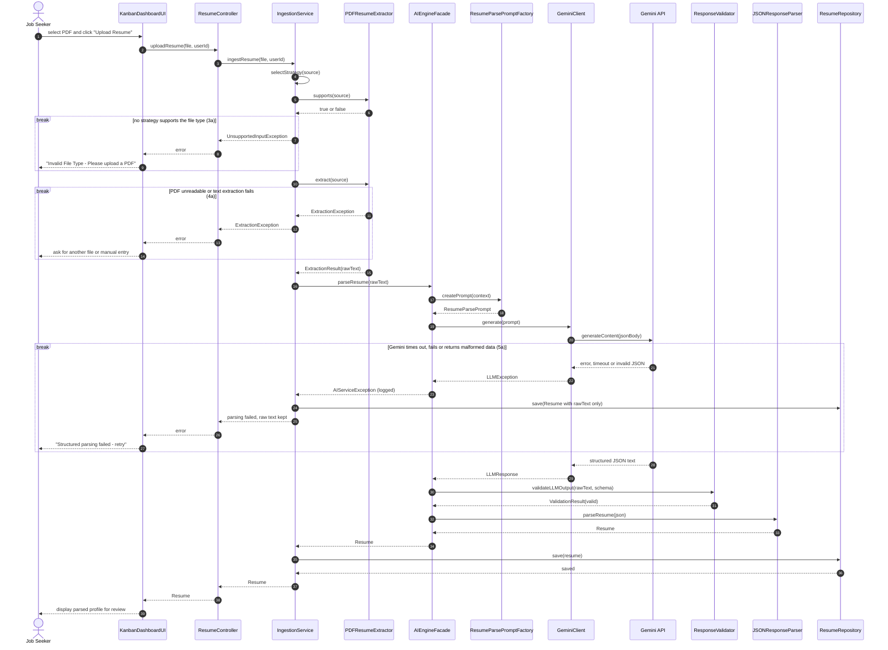

---

## SD-02: Import Job Posting (F02, UC-02)

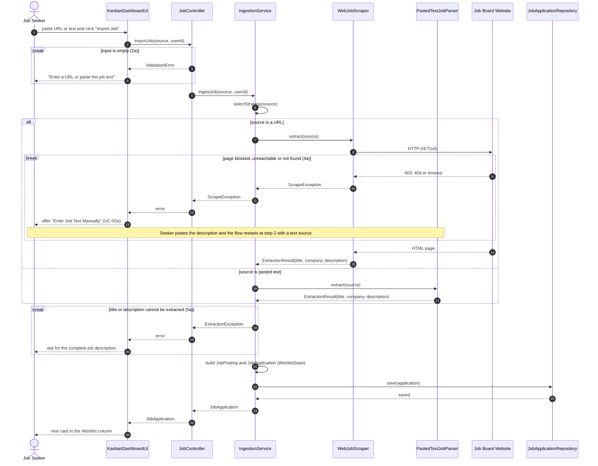

---

## SD-03: Analyze Skill Gap and Match (F03, UC-03)

This diagram shows the full AI pipeline (controller, facade, prompt factory, Gemini adapter, validation and retry). SD-04, SD-07, SD-08 and SD-12 reuse the same pipeline with their own factory and prompt.

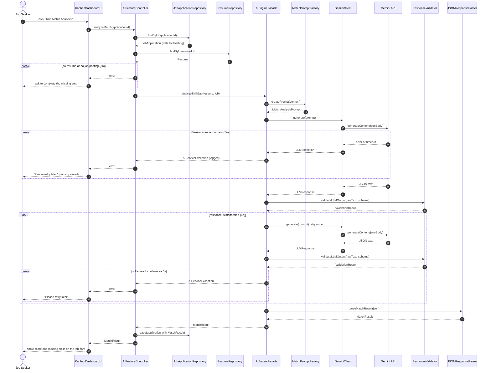

---

## SD-04: Generate Cover Letter (F04, UC-04)

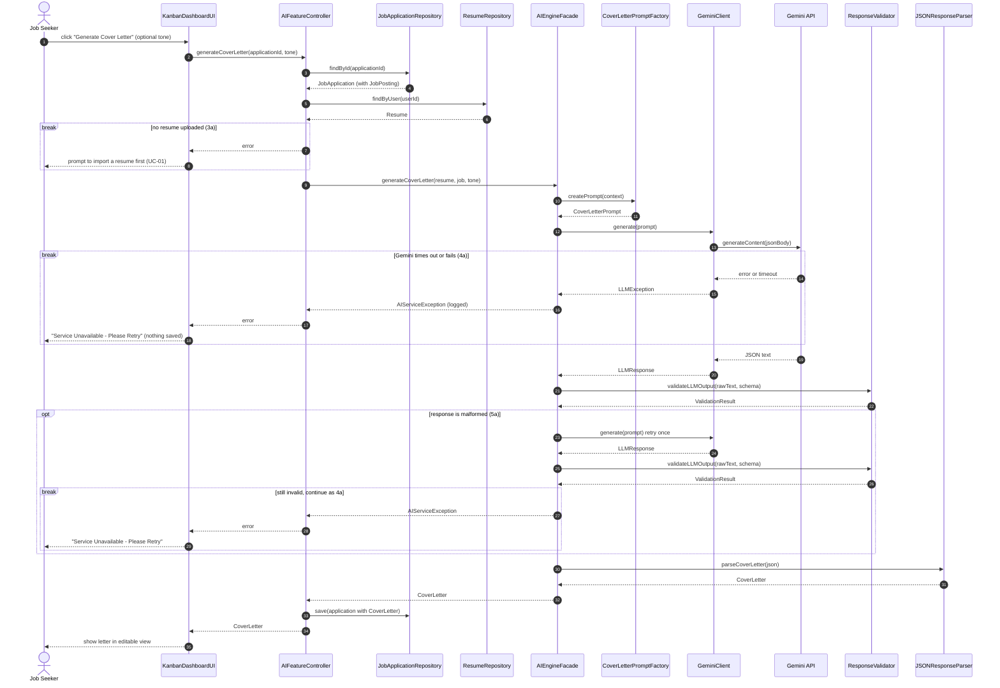

---

## SD-05: Manage Application Pipeline (F05, UC-05)

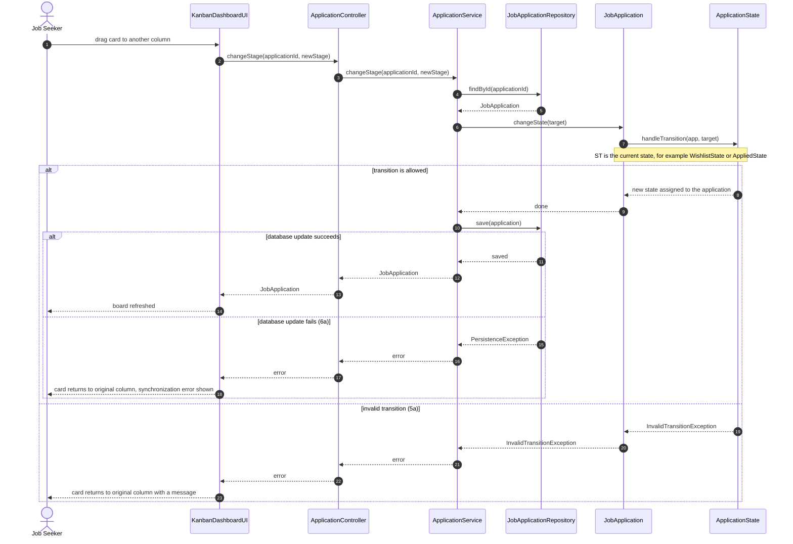

---

## SD-06: Track Deadlines and Receive Alerts (F06, UC-06)

Part A is user-triggered (setting a deadline). Part B is timer-triggered and uses the Observer pattern.

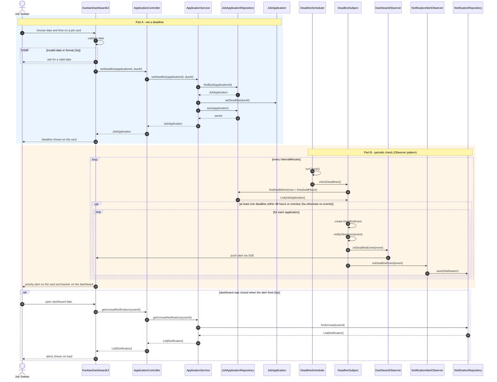

---

## SD-07: Generate Interview Prep Sheet (F07, UC-07)

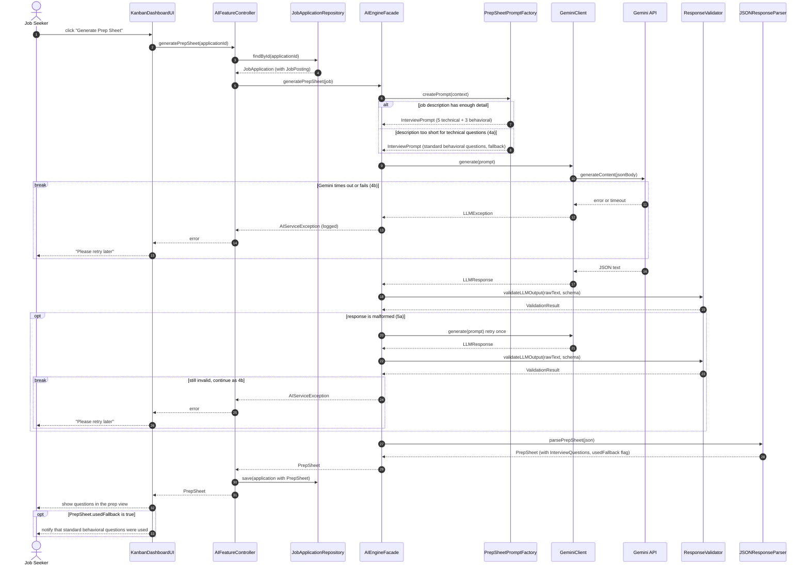

---

## SD-08: Optimize Resume Bullet Point (F08, UC-08)

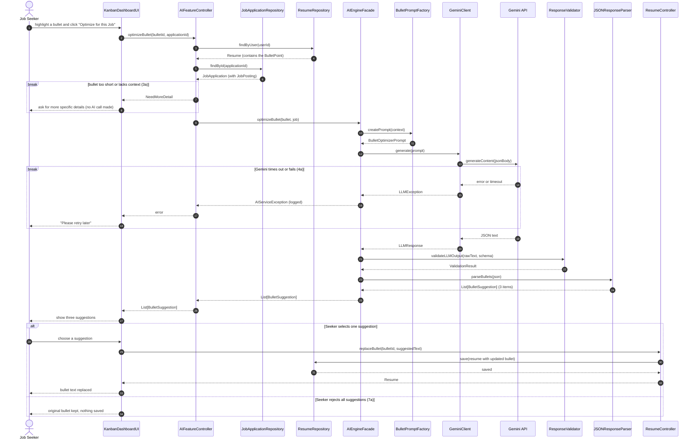

---

## SD-09: View Job Search Analytics (F09, UC-09)

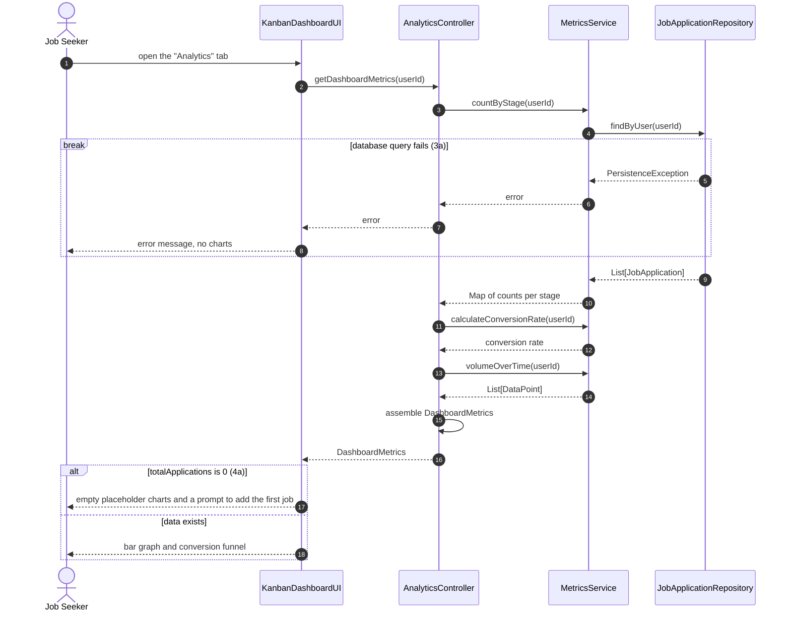

---

## SD-10: Export Application Package (F10, UC-10)

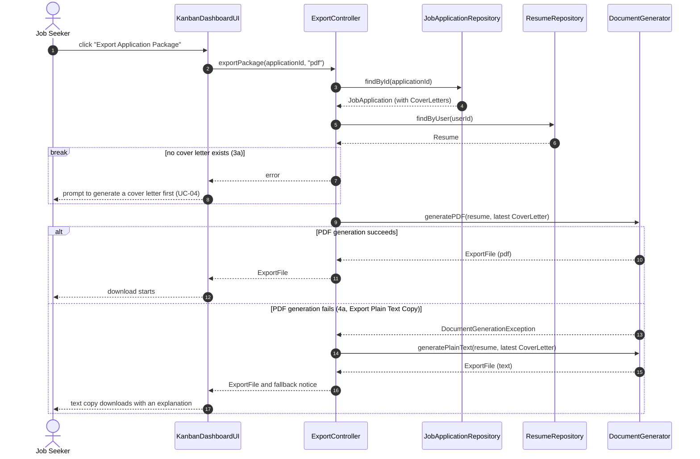

---

## SD-11: Run Career Agent Assistant (F11, UC-11)

This is the central agent diagram: memory recall, planning through the LLM, validated tool execution, replanning on failure, and memory storage.

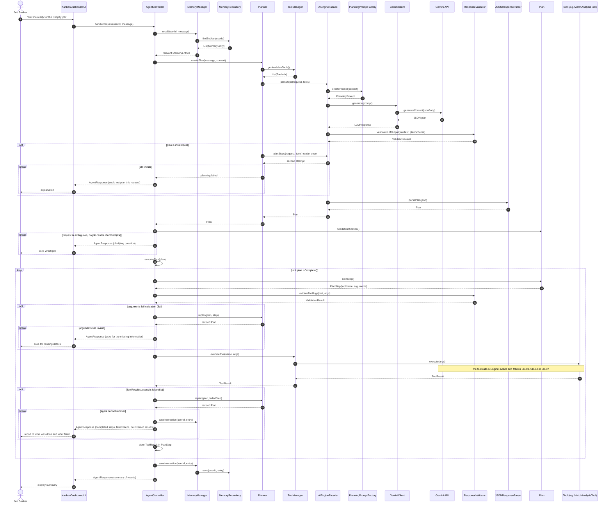

---

## SD-12: Practice Mock Interview (F12, UC-12)

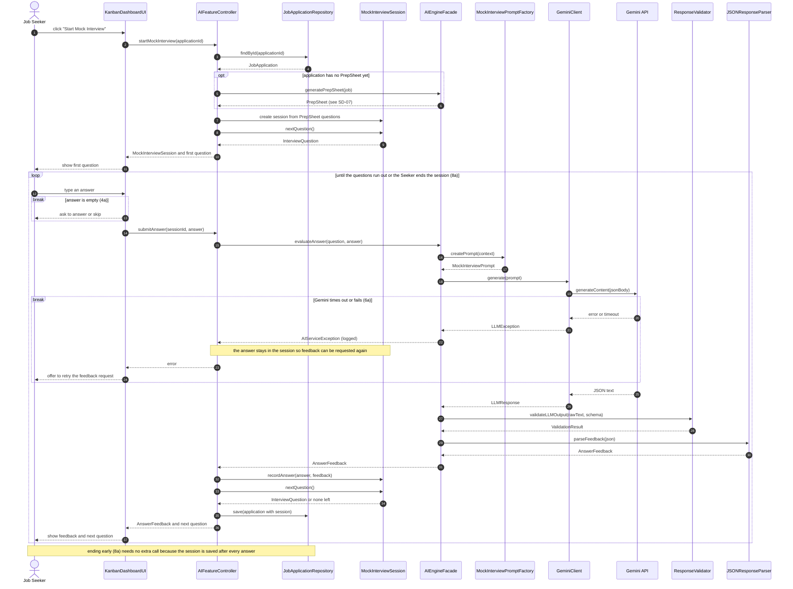

---

## SD-13: Run a Feature from the CLI (Command pattern)

The CLI reaches the same controllers as the GUI. Each CLI request becomes a `Command` object (receiver: a controller) that the `CommandInvoker` executes and records. The example is `GenerateCoverLetterCommand`; the other ten commands (`ImportResumeCommand`, `ImportJobCommand`, `AnalyzeMatchCommand`, `RunAgentCommand`, `GeneratePrepSheetCommand`, `OptimizeBulletCommand`, `MovePipelineCommand`, `ViewAnalyticsCommand`, `ExportPackageCommand`, `StartMockInterviewCommand`) follow the same structure and differ only in their receiver controller.

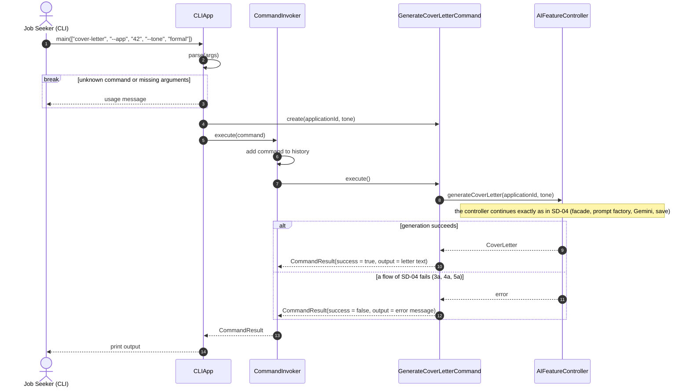
